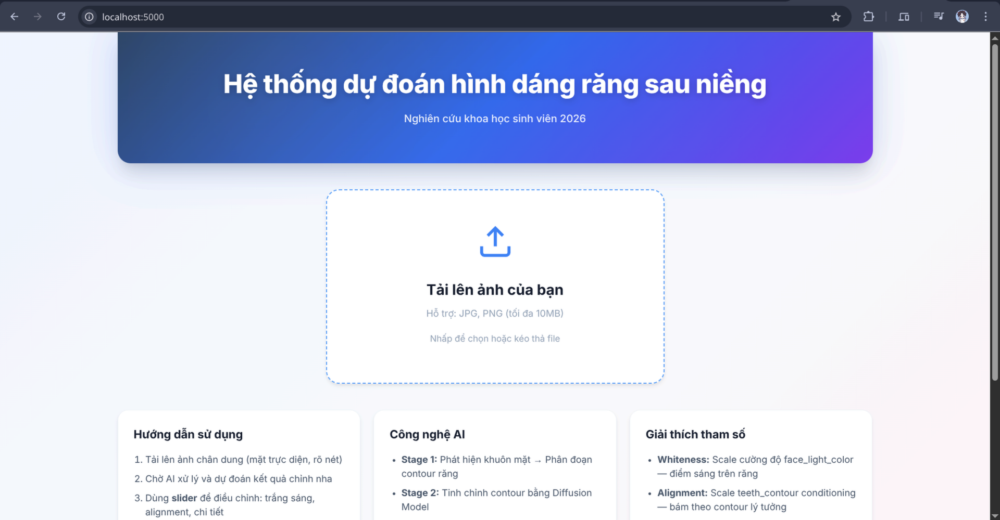
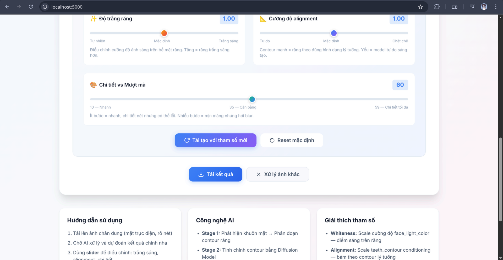
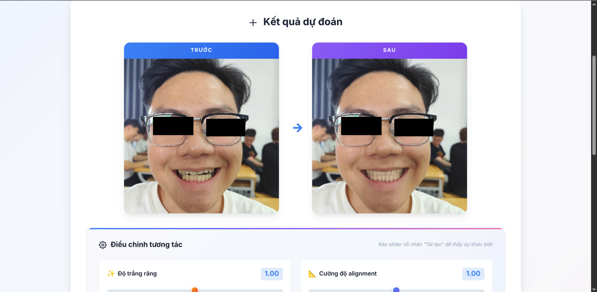
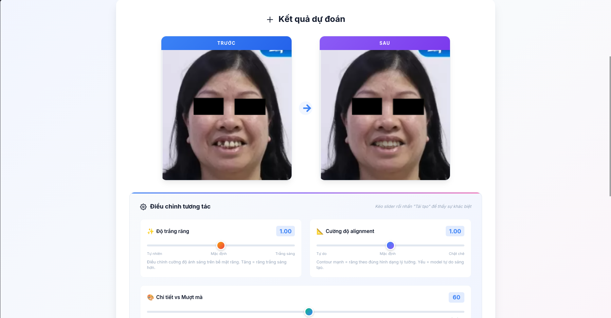
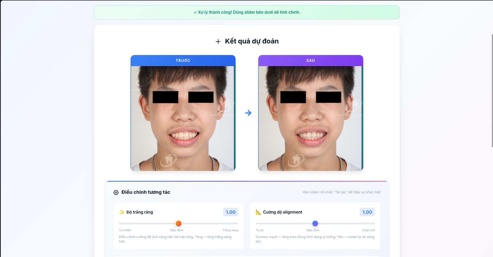

# Research and Development of a Tooth Shape Prediction System Post-Orthodontics

This project focuses on building an AI-powered system capable of predicting a user's tooth shape after the orthodontic process based on pre-treatment dental images. The system provides an intuitive Web interface to help users visualize treatment outcomes.

## Credits & Acknowledgments

This project is inherited and developed based on the original source code and research:
*   **Original Repo:** [3D-Structure-guided-Network-for-Tooth-Alignment-in-2D-Photograph](https://github.com/ShanghaiTech-IMPACT/3D-Structure-guided-Network-for-Tooth-Alignment-in-2D-Photograph)
*   **Original Paper:** *'3D Structure-guided Network for Tooth Alignment in 2D Photograph'* (BMVC 2023).
*   **Supervisor:** MSc. Tran Thi Dung.

> "This project is built upon the implementation by Yulong Dou et al. and extends it into a full-stack AI service."

## Research Content & Key Contributions

In this study, we have made significant contributions and changes compared to the original version:

1.  **Data:** Collected and pre-processed (normalized, cleaned, augmented) dental images from public sources to improve model robustness.
2.  **System Architecture:** 
    *   Converted the research model into an optimized format for **NVIDIA Triton Inference Server**.
    *   Developed a **Microservices** architecture to decouple AI processing, Backend, and Frontend components.
3.  **Deployment:** 
    *   Utilized **FastAPI** for the Backend to efficiently manage requests and image I/O.
    *   Developed a **Web Interface (Frontend)** for users to upload images and receive visual results.
    *   The entire system is containerized using **Docker**, ensuring consistent installation and deployment across different environments.

## Expected Results

*   A complete web-based AI system supporting tooth shape prediction.
*   Assisting orthodontic patients in visualizing aesthetic outcomes after long-term treatment.
*   Optimized image processing time via a dedicated inference server.

## Demo Gallery

The following images demonstrate the system's interface and workflow:

<div align="center">
  
  <p><i>Figure 1: Home Page - Image Upload Interface</i></p>
  <br>
  
  <p><i>Figure 2: System Configuration and Parameter Setup</i></p>
  <br>
  
  <p><i>Figure 3: Prediction Results - Comparing Before and After Orthodontics</i></p>
    <br>
  
  <p><i>Figure 3: Prediction Results - Comparing Before and After Orthodontics</i></p>
    <br>
  
  <p><i>Figure 3: Prediction Results - Comparing Before and After Orthodontics</i></p>
</div>

## Setup & Environment

### System Requirements
*   **Operating System:** Linux, Window.
*   **Hardware:** 
    *   **GPU:** NVIDIA GPU (required for loading model stages on Triton Server).
    *   **RAM:** Minimum **16GB System RAM** (ensures stable operation when running multiple containers simultaneously).
    *   **Storage:** Minimum **30GB** disk space for Docker Images and model weights.
*   **Tools:** Docker, Docker Compose, NVIDIA Container Toolkit (linux).

### Dependencies
The system utilizes the following main libraries:
*   **Triton Inference Server:** AI model serving.
*   **FastAPI:** Backend logic.
*   **Python 3.10+** (inside Docker containers).
*   **CUDA 11.8+** (compatible with NVIDIA drivers).

## Usage

### 1. Prepare Model Weights
Download the weight files (.pth) following the instructions in [Code/Stage2/ckpt/download_ckpt.txt](./Code/Stage2/ckpt/download_ckpt.txt) and [Code/Stage3/ckpt/download_ckpt.txt](./Code/Stage3/ckpt/download_ckpt.txt). Ensure the weights are placed in the correct location within `triton_model_repository`.

### 2. Launch with Docker Compose
Open the terminal in the root directory of the project and run:
```bash
docker-compose up --build
```
This command initializes 3 services:
*   **Triton Server:** Port `8000` (Inference engine).
*   **Backend (API):** Port `8001` (FastAPI).
*   **Frontend (Web UI):** Port `5000` (User interface).

### 3. How to Use
1.  Access: `http://localhost:5000`.
2.  Upload a frontal dental photograph.
3.  Wait for the system to process (Triton will perform multi-stage inference).
4.  View the predicted tooth shape result directly on the interface.
